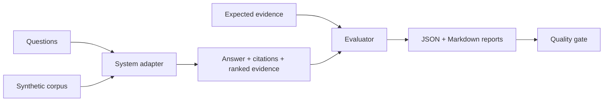

# Flowimax RAG Evaluation Kit

[](https://github.com/maxnguyen2102/flowimax-rag-evaluation-kit/actions/workflows/verify.yml)
[](https://nodejs.org/)
[](LICENSE)

A reproducible portfolio project for evaluating whether a source-grounded RAG system retrieves the expected evidence, cites it correctly and abstains when the corpus cannot support an answer.

> This repository demonstrates an evaluation method. Its synthetic results are not claims about Flowimax production performance, customers or business outcomes.

## Evidence at a glance

| Evidence | Included |
| --- | ---: |
| Versioned evaluation cases | 22 |
| Fictional corpus chunks | 12 |
| Automated behavior tests | 6 |
| Report formats | JSON + Markdown |
| External services or API keys | None |

The included synthetic baseline currently passes all declared gates. See the [complete report](reports/latest-report.md), including thresholds and limitations.

## The client-shaped problem

“The chatbot works” is not enough evidence. A useful RAG evaluation should show whether the system retrieved the expected source, cited it correctly, covered the required answer points, abstained when evidence was missing and stayed within a declared latency boundary.

This kit turns those questions into versioned cases, deterministic metrics and a report that keeps individual failures visible.

## What I built

- A replaceable system-adapter contract for answers, citations and ranked evidence.
- A versioned JSONL dataset with answerable and deliberately unanswerable cases.
- Deterministic retrieval, citation, answer-coverage and abstention metrics.
- Machine-readable and reviewer-friendly reports with explicit quality gates.
- Unit tests and GitHub Actions verification.
- A pre-publication audit for credential patterns, personal data, machine paths, private terms and Git history.

## What it measures

- Retrieval hit@3 and mean reciprocal rank.
- Citation precision and recall.
- Answer-point coverage.
- Abstention accuracy.
- Local p95 latency.
- Per-case failures without hiding unsuccessful examples.

## Review it in 60 seconds

1. Read the [latest report](reports/latest-report.md).
2. Inspect the versioned [evaluation cases](evals/dataset.jsonl).
3. Check the [evaluation policy](docs/evaluation-plan.md) and [honest case study](docs/case-study.md).
4. Open the latest GitHub Actions run from the verification badge.

## Run it in five minutes

Requirements: Node.js 20 or newer. No database, API key or dependency installation is required.

```bash
npm run verify
```

Generated artifacts:

- `reports/latest-report.json`
- `reports/latest-report.md`

The verification command scans current files and Git history for likely credentials, personal or machine-specific information, and locally configured private terms before running tests. See the [publication checklist](PUBLICATION_CHECKLIST.md).

## Architecture



The current adapter is deterministic lexical retrieval so anyone can reproduce the report for free. The evaluator is separated from the adapter, allowing a private RAG system to implement the same output contract without publishing its corpus.

## Repository map

```text
evals/dataset.jsonl       versioned evaluation cases
fixtures/corpus.jsonl     fictional source corpus
src/demo-system.mjs       replaceable system adapter
src/metrics.mjs           deterministic metrics
src/run-evaluation.mjs    evaluation runner
reports/                  complete sample results
tests/                    metric behavior tests
docs/                     architecture and evaluation policy
```

## Evaluation workflow

1. Define an answerability policy and expected evidence IDs.
2. Run every case against the same system adapter.
3. Keep ranked retrieved IDs, citations, answer coverage and latency per case.
4. Aggregate only after preserving individual results.
5. Inspect failures and update the system or dataset with a versioned change.

See the [evaluation plan](docs/evaluation-plan.md), [architecture](docs/architecture.md), [case study](docs/case-study.md) and [security boundary](SECURITY.md).

## What this proves—and what it does not

**It proves:** the included evaluation contract, dataset, metrics, report generation, safety checks and CI can be reproduced from a clean checkout.

**It does not prove:** production accuracy, semantic retrieval quality on a private corpus, hosted latency, business impact or customer outcomes.

## Honest limitations

- The corpus and questions are synthetic.
- The demo retriever is not Flowimax production retrieval.
- Phrase matching is a transparent baseline, not a substitute for human or model-based semantic grading.
- Local latency excludes networks, hosted databases and LLM calls.

## Next extension

Add a private adapter that calls a locally running RAG endpoint, while keeping documents and outputs outside this public repository. Compare the same dataset versions rather than rewriting successful examples after each run.
