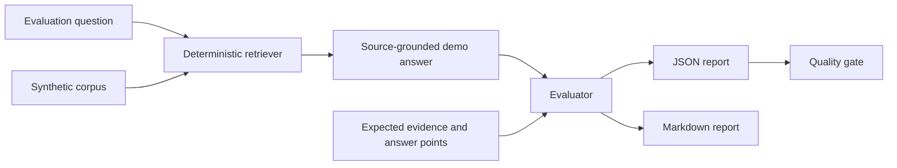

# Architecture

The demo adapter is deliberately simple. The reusable part is the evaluation contract: a system returns an answer, citations, ranked evidence IDs, abstention status and latency. A real Flowimax adapter can implement the same contract without changing metrics or reports.

## Data flow

1. Load a synthetic corpus and versioned JSONL test set.
2. Retrieve the top three chunks without any external API.
3. Produce an extractive answer or abstain when evidence is weak.
4. Evaluate retrieval, citations, answer points, abstention and latency per case.
5. Preserve every case result in machine-readable JSON and a reviewer-friendly Markdown report.
